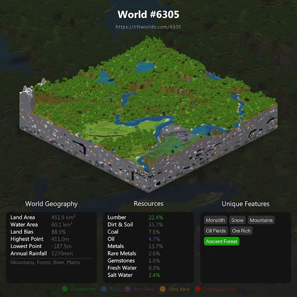

# board/card that can be placed as tile on global map
  
## "traits" that affect tiles next to it. example "bandit" that steal resources. or example provide betteer stats like freshwater. placed like puzzle piece next to other tiles on a onchain grid. action happen and is calculated every x blocks. Big canvas with tiles. Kinda like screeps with map option to get view that looks like eu4/stelaris maps 
    
# example traits
> - Strip mine. Reduce water quality and polluites area nearby.
> - spring. Increase fertility or other stats to to tiles next to it.
> - plastic factory. increase incom with plastic and drains oil from nearby tiles.
> - bandit camp. next to town/village steal incom
> - village give income and trade mechanic
> - town. increase value to nearby resources

# stack
> - https://pixijs.io/