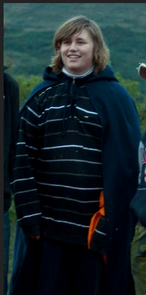
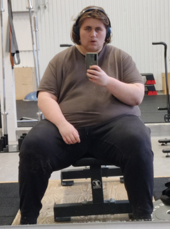
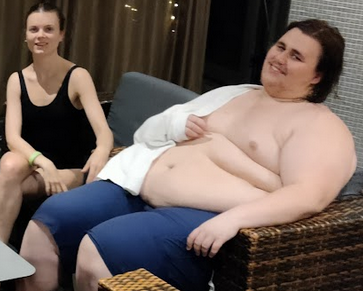
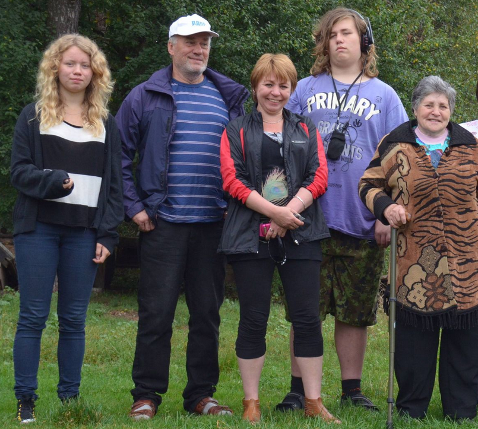

## kms
25 years and feels like life is already over. im **morbidly obese** hugless virgin. Recent memory of being sexualy abused when I was 11-12 in a cheap hostel in latvia my dad left me at. Was often left at the hostel when I went with my dad when he traveled.
It happens when a mid 30 man started climbing into other ppls bed. he entered my bed and started touching me. eventually the hostel owner entered the dorm and for some reason i still don't understand is that they left after talking to one of the persons in Recently and this has been the reason and the fact i have been trying to improve and cant is the reason about a lot of recent suicidal thought.
 
 ## Fighting in realy teens
I remember about mom and dad fighting. why i cant remember but this happened when i was 14 some of the reasons was money and dad cheating on her. I remember mother coming crying to me and she wants to move away and wants help. i denied her and told me i want to stay with dad and she should as well. After that fighting and atmosphere got worse. I deeply regret not going with her and that might have saved her if her cause of death was sucide and not a freak accident.

## why am i so fat.
 i cant remember ever being a healthy weight always topping highest bmi for other in same age. Always been the fattest compared to other children. Always had been smelly and had a bad hygiene. I have been think why and how i got so fat. if i have been obese since a child it cant be something i did wrong. at least that early in my life there was nothing i could have done and my sister was a healthy weight and ate the same food and the same after school activity. I was bullied since the day i started in preschool(heard about being bullied by russian cousins before that but got no memory of it). It only really stopped when i entered highschool. My sister was as well but not in the same extent. It really is a mystery to me atleast that young. After highschool i had more control and peer pressure on losing weight. Never took it serious until 9th grade. after that i have been trying but keep failing year after year.
    another theory to why is that i spent a lot of time more with my dad and he had an influence on what i ate. I remember eating fast food a lot with him but usually the cheapest thing on the menu just to have a reason to sit at the restaurant. At the end i agree that after i exited middle school i should have been able to figure it out.

**gaming** has been a weird relationship. Its the only thing that has gotten me a lot of social contact but is allso a really big timewaste and escapeism from problems. Curently i whould like to stop with all video games allthogheter and solely play dnd online to keep relatsionships.
 
## last romans
breaking point was our **dog ivan dying** dad got bored and depressed then moved to weird old juggsolvia women. First was donna that was swift and left after dad realised the motives for him paying her to get here was partnership. Later he went and started to barter and donate to the local gypsies. He offred them to temporary live in his big house in south part of town. The family consist of antonOfficale maria and their dad. **Maria** was my dads love intrest and he tried to seduce her when she was about 15. Cant really know the age as my dad said 18 year after year. She stole alot of Anna my sisters belongings and old jewlery my mother left behind. A couple years later around 2019 a phone was taken out on dads credit card. He was paranoid and stated to accuse hackers and everyone around him. My friend worked there and got security camera footage and got confirmed it was Marias dad. Dad brused it aside and didnet belive maria was a part of it. AntonOfficales history is short but horrible. He was in the same car as Anna and try to sexually assult her in the car. Tried to steal electronics from me and count less other things from dad. The Marias dad has countless times scammed my father into buing shithole cars.

Recently about my house neigboring dads house he wrote over to me for tax reasons. 2021 i stuff on the lawn and the door open. went in and saw tools and stuff lying around in the house. Took it all and hid it in the basment. On my way away i saw about 7 young romainan guys carrying a bed towards the house. I halted them and tried to understand what happen concluding to me telling i was calling the cops if i saw them again. When i first arrived at the house i called dad about the tools and he had no ide but told me to not touch the tools and just leave. After i confronted them he said the let them stay there.
Current time i say someone trying to get the electricity started and moved stuffed around. Dad had no ide. I start to smell cheap perfume and someone looking in weird storages and outhouses. Dad has no ide. 2 weeks later Maria arrives and sleep over and wake up tho her and her dad cleaning the house. later he called me about the outhouse and antonOfficale trying to fix it. I got filled with anger and told dad to get them out. He responded with "i and you need help and noone else is using it" I ended the call that if they are around for a prolonged time im ending all contact with him. Hes been lying for weeks about the stuff going around in the two houses.

# damage control plan
**small increment** try to make small progress every week and detect when habit is breaking and read manifesto again.
## current plan
- no to low soda. Works if i force myself to drink water and sweetened tea. Plan is to move away from sweet te slowly.
- no/almost no gaming. Just enough to keep friendship alive and stimulate social interaction
- slowley working to estab 9-5

## dharma
- Exit kth with kemistry degree. 
- Make atleast something succseful in crypto. 
- Make a working cheat for any mp game

  

  
  
  
  
