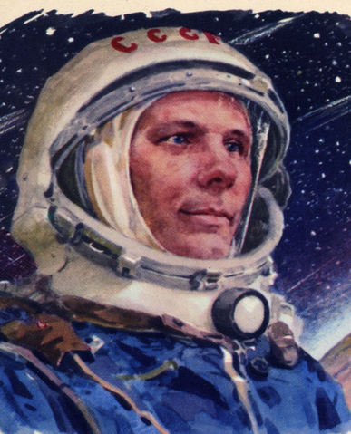
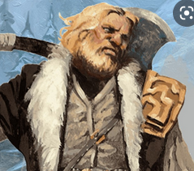
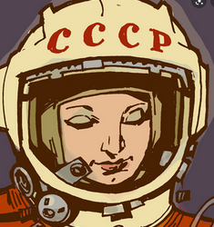
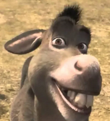

# ALEXI: character for dnd level20 mythic
  

Jobbar som kemist och var lärare på universitet på Moskva. Efter flera space anomalies och mysteriska försvunen Paris. Skickades ut med andra Ingenjörer och vetenskaps män för att följa spåren av vart paris försvann. Han hittade paris  och spenderade flera år i Paris och  städer runtomkring i Carcosa . Efter Carcosa kollapse när richard fukka up skit med hastur flydda han med överlevande från från paris och hans ryska bröder till gollarion där de skapa "New Paris". Han läde sig konsten att combinera kemi och arcane från Tesla när han fortfarande bode i carcosa innan han vart förstenad och fångad av meteus. 

New paris är en liten stad med runt 5000 personer. Har aktivt kontakt med jorden genom färder dit med rymdskeppet eller magi. Är en extension av sovjets och har representater av dem i staden

> **igor**: barbarian och ex kgb. problem med autheritet och ett "wildcard".
> **träning och utbildning**: Miltär utbildning och 2 turer till tjetenien. Skickad på updraget för att hålla kontroll och stoppa andra comsmonaouter att gå "rouge".
> **relationer**: Hatar åsna

> **irina**: läkare och fysiker. Borgmästaren över "new paris" som ligger i golarion
> **träning och utbildning**: Utbildad i Moskva uni.
> **relationer** Gillad av alla. Hatar alexi efter han röstade ut impostern.

> **åsna**: ingen vet varför åsnan faktist är med men gått så lång tid så ingen våga fråga heller.
> **träning och utbildning** Dra tunga saker och äta havre. Även en ond demon i camoflage.
> **relation** Den gammla asiatiska mannen gillar han