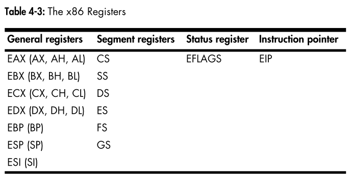
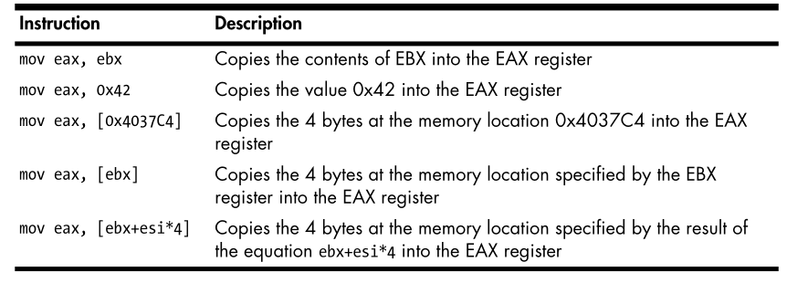
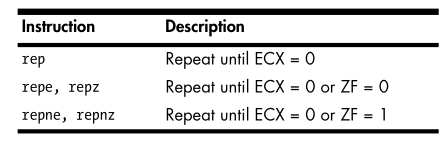

# ram
> data: data when loaded. static/global values
> Code: code
> heap: dynamic memory to allocate new values and free unused.
> Stack: local variables and function parameters to help program flow.
    uses push/pop last in first out. esp stack pointer that points to top of stack. ebp base pointer stays constant program use as a placeholder to keep track of location and local variables/parameters.

# Registers
> General reg: used by cpu. multi and div use EAX and EDX. Compiler conventions to understand faster. EAX used for return value for example

> Segment reg: track section of memory

> Status flags: used for decision. 1 or 0 depending on flag.
> zf: result is zero
> cf: to large or to small
> sf negativ or cleard
> tf: only when debugging

> EIP: Instrcution point: keep track of next Instruction. only purp is to tell what to do next
  

# Instruction
## mov lea
> MOV take variables from right to left
>   
> lea similar to mov. put memory adress into destin. lea eax, [ebx+8] will put EBX+8 into EAX.
> sometimes used to calculate values as its shorter and more effiecient ex:  lea ebx, [eax*5+5]

## Artihmetic
> xor eax, eax is a quick
    way to set the EAX register to zero for optimization.
> shr and shl instructions are used to shift registers
> function containing only
the instructions xor, or, and, shl, ror, shr, or rol repeatedly and seemingly ran-
domly, you have probably encountered an encryption or compression function 
## stack instructions
> push,
> pop,
> call
> leave
> enter
> ret
## function calls
when called it got prologue that prepares stack and registers. epiologe that restores stack and registers. returns with ret value into eip. maintains its own stack frame until returned.
## conditionals
 test: identical to && operand inv are not modified only sets the flags used to check for null when used agains it self
 cmp: cmp instruction is identical to the sub instruction; however, the operands are not affected. The cmp instruction is used only to set the flags
 jmp: used instead of if. branch to other code at adress. alot diffrent with j-prefix

 ## rep
> databuffers aka array of bytes
> movsx
> cpmsx
> stosx
> scasx
> where x = b, w, or d for byte, word, or double word
> esi = source index register  
> edi destenation index register. 
> ecx counting variable. ussaly repeat until 0 
>   
> movsb used to move databuffer from a to b. used with rep
> cmpsb detect if same data