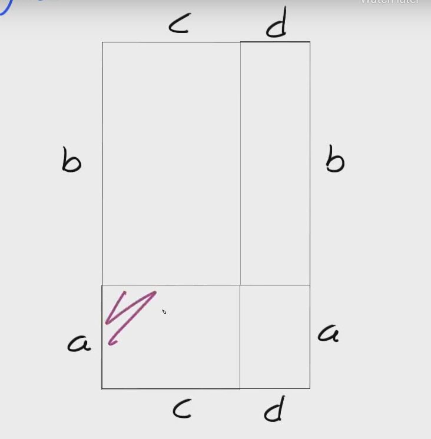
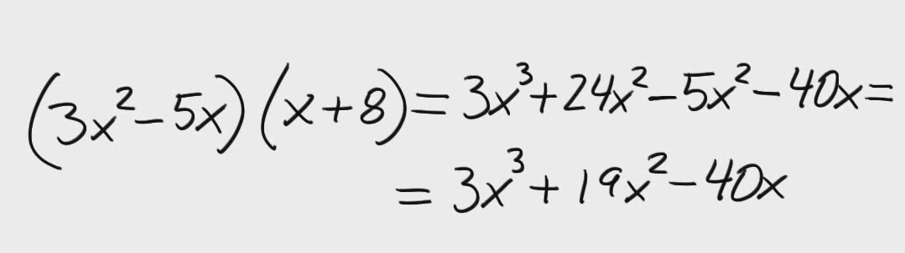

# Algebra

polynom är matimatisk modell för att beskriva sistuationer.

består av variable tillex x,y,z och konstanter 1 -2 och kompineras med räknesätt
x^2 + 3x - 1

kan inte addera olika exponent 2^3+2^4
lösning via att förenkla så långt det går

gravitation fallande object är v = 9.81 * x
x är seckunder och v är resultatet 

## (a+b)(c+d) = ac+ad+bc+bd och kan användas för att räkna ut arean på rektangel.   
## när 2 ( ) multipleceras med varandra varje sida måste multipleceras med varje på andra
  

Linjär funktion
y(x) = x+5
värdet av y beror på vad x är
x(2) = 2+5 är exempel

AndragradsEkv

ekvation ena led är andragrad och andra är lika med 0 = andragrad ekv

Andragrads polynom
ax^2 + bx + c = 0

a b och c är konstanter och a != 0 om a = 0, så hade ju x²-termen blivit lika med noll och då hade inte polynomet varit av grad 2 längre

andragrads funktion

f(x) = ax^2 + bx + c 
funktion där utrycket är en polynmom

Andragrads ekvationer

Kvadrerings reglen
